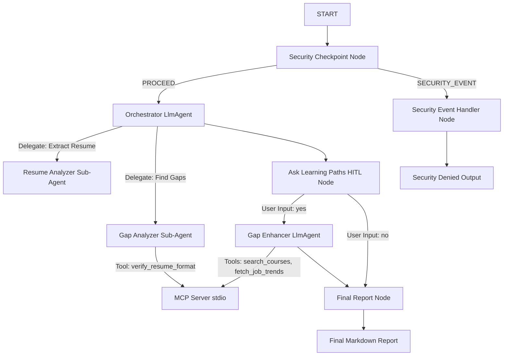

# Submission Write-Up: resume-gap-analyzer

## Problem Statement
Job searching is highly competitive. Job seekers often struggle to align their resumes with complex job descriptions, resulting in rejection by automated ATS (Applicant Tracking Systems) or human recruiters due to missing keyword matches or layout formatting issues. 
Additionally, sharing resumes in cloud platforms raises PII privacy concerns (exposing home phone numbers, personal emails, or SSNs), while interacting with LLMs exposes platforms to prompt injection security risks. 
`resume-gap-analyzer` addresses these issues by offering a secure, multi-agent AI assistant that audits resumes for formatting and PII leaks, computes exact skill gaps, asks for human consent before fetching external learning resources, and queries an MCP server to recommend high-quality courses to bridge those gaps.

---

## Solution Architecture



---

## Concepts Used

This project implements all core capabilities of the Gemini Enterprise Agent Platform and the ADK 2.0 SDK:

1.  **ADK 2.0 Workflow Graph**: The orchestration is written as a graph in [agent.py](file:///c:/Users/Savithri/Downloads/adk.config/resume-gap-analyzer/app/agent.py#L183-L194). This enables deterministic control flow, routing decisions, and a clean separation of concerns.
2.  **LlmAgent & AgentTool Delegation**: The [orchestrator](file:///c:/Users/Savithri/Downloads/adk.config/resume-gap-analyzer/app/agent.py#L94-L106) LlmAgent uses `AgentTool` to delegate specific tasks to specialized sub-agents: `resume_analyzer` (extraction) and `gap_analyzer` (comparison).
3.  **MCP Server Integration**: A python-based [MCP server](file:///c:/Users/Savithri/Downloads/adk.config/resume-gap-analyzer/app/mcp_server.py) is implemented using the `FastMCP` standard. It exposes three native tools (`verify_resume_format`, `search_courses`, `fetch_job_trends`) which are wired directly to the sub-agents.
4.  **Security Checkpoint**: The [security_checkpoint](file:///c:/Users/Savithri/Downloads/adk.config/resume-gap-analyzer/app/agent.py#L126-L167) node acts as an entry guardrail, scrubbing PII, intercepting prompt injections, and generating structured JSON logs saved in context state.
5.  **Human-in-the-Loop (HITL)**: A [pause-and-resume node](file:///c:/Users/Savithri/Downloads/adk.config/resume-gap-analyzer/app/agent.py#L176-L189) yields `RequestInput` to prompt the candidate for consent before triggering resource-intensive external course searches.

---

## Security Design
*   **PII Redaction**: Regex-based filters scrub emails, US Social Security Numbers, and phone numbers before the resume content is passed to any LLM.
*   **Prompt Injection Mitigation**: A keyword blacklist checks for common adversarial phrases like `ignore previous instructions` or `bypass guardrails`. If detected, the workflow instantly stops and routes to a secure denial node.
*   **Domain-Specific Input Validation**: The checkpoint checks for basic resume structural indicators (e.g. keywords like `education`, `skills`, `experience`). Documents lacking these are rejected with `WARNING` severity.
*   **JSON Audit Logging**: Generates detailed JSON logs with timestamp, indicators, and severity levels (`INFO`, `WARNING`, `CRITICAL`), written to `ctx.state` for compliance tracking.

---

## MCP Server Design
The FastMCP server runs on stdio transport and exposes:
1.  **`verify_resume_format`**: Measures word count, flags placeholder elements (e.g., "[phone]"), and checks for essential section headers to evaluate ATS friendliness.
2.  **`search_courses`**: Takes missing skills as input and returns top online courses (from Coursera, Udemy, etc.) relevant to the gap.
3.  **`fetch_job_trends`**: Provides market stats, demand percentages, and salary premiums for the missing skills.

---

## HITL Flow
The workflow pauses after the initial gap evaluation using:
```python
yield RequestInput(
    interrupt_id="suggest_courses",
    message="Would you like me to fetch learning resources and courses to help you fill the identified skill gaps? (yes/no)"
)
```
This gives the user explicit agency over the agent's behavior, saves quota by avoiding redundant external lookups, and complies with corporate safety standards.

---

## Demo Walkthrough
Refer to the three test cases documented in the [README.md](file:///c:/Users/Savithri/Downloads/adk.config/resume-gap-analyzer/README.md#sample-test-cases) for a full demo walkthrough.

---

## Impact / Value Statement
`resume-gap-analyzer` bridges the gap between career counseling and automated recruitment. By empowering candidates with a secure tool to analyze their resumes, identify weak areas, and immediately find courses, it dramatically boosts hiring success. For recruitment firms and university career centers, it provides a secure, automated gateway to prep candidates at scale without exposing sensitive personal data.
